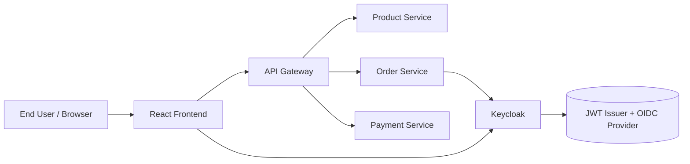
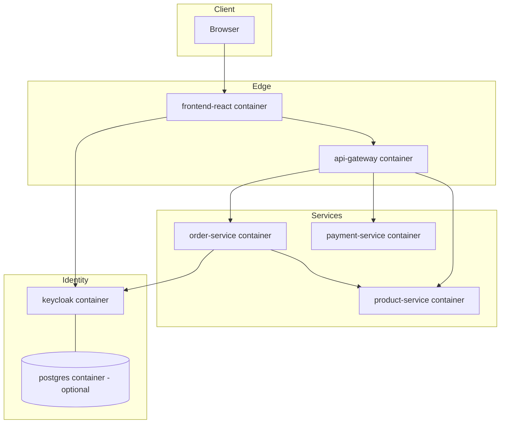
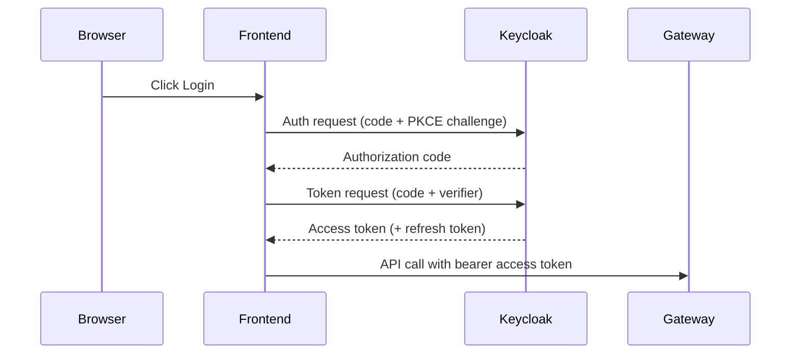
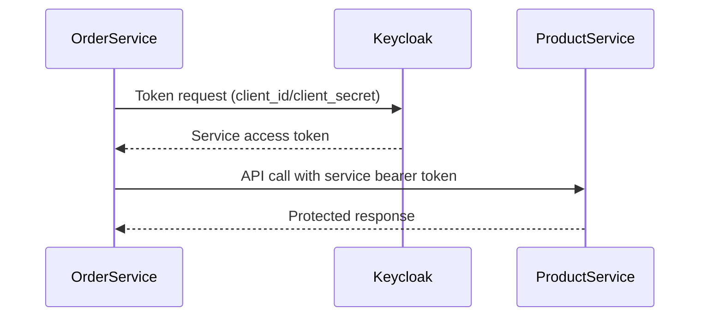
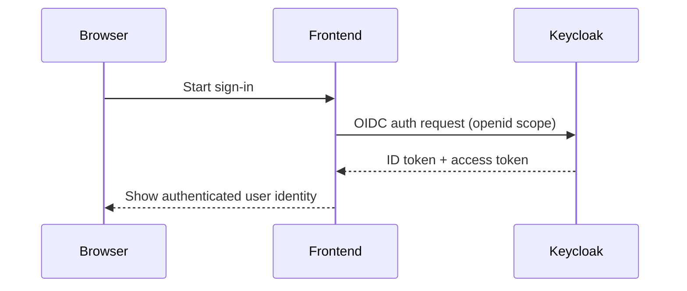
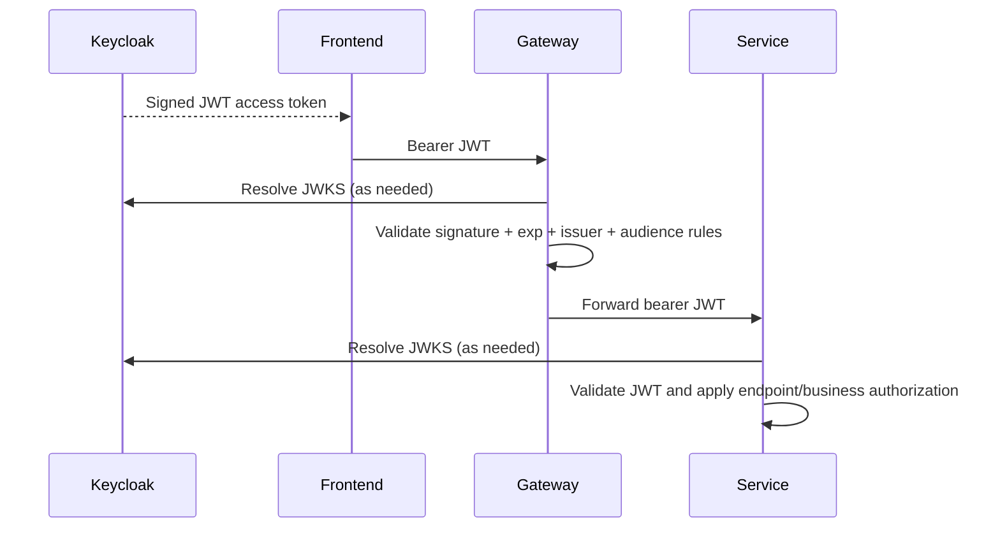
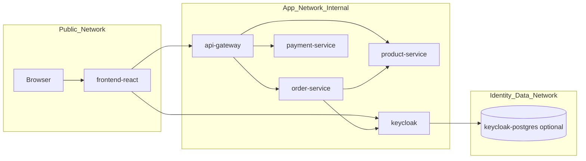

# Architecture

## 1. Architecture Goals
This project demonstrates a modern OAuth2/OIDC microservices architecture for learning purposes, showing how identity, token-based security, gateway enforcement, and service-to-service authentication work together in a runnable system.

Technology baseline:
- Java 25
- Spring Boot 4.x
- Spring Security 7.x
- Spring Cloud Gateway
- Keycloak
- React
- Maven multi-module monorepo
- Docker Compose

## 2. System Context Diagram


Context summary:
- User interacts with React frontend.
- Frontend authenticates users with Keycloak.
- Frontend calls the API Gateway with bearer JWTs.
- Gateway routes traffic to backend services.
- Order Service uses Keycloak for client credentials when calling Product Service.

## 3. Container Diagram


## 4. Service Responsibilities
### Product Service
- OAuth2 Resource Server validating JWT via Keycloak JWKS.
- Serves public and authenticated product views.
- Enforces admin-only write operation for product creation.
- Supports service-to-service reads initiated by Order Service.

### Order Service
- OAuth2 Resource Server validating JWT.
- Enforces `orders.read` and `orders.write` scopes.
- Derives current user from JWT claims.
- Returns only orders belonging to authenticated user.
- Calls Product Service via Client Credentials flow.

### Payment Service
- OAuth2 Resource Server validating JWT.
- Enforces `payments.write` scope.
- Simulates payment processing with business authorization checks.
- Demonstrates separation of authentication, authorization, and business authorization.

## 5. API Gateway Responsibilities
- Entry point for frontend API traffic.
- Validates JWT on inbound protected routes.
- Applies route-level authorization by authentication/scope.
- Routes requests to target services:
  - `/api/products/**` -> `product-service`
  - `/api/orders/**` -> `order-service`
  - `/api/payments/**` -> `payment-service`
- Forwards bearer tokens downstream for service-level validation and authorization.

Gateway policy targets:
- `GET /api/products/public` -> public
- `GET /api/products` -> authenticated
- `GET /api/orders` -> `orders.read`
- `POST /api/orders` -> `orders.write`
- `POST /api/payments` -> `payments.write`

## 6. Keycloak Responsibilities
- Acts as OAuth2 Authorization Server.
- Acts as OpenID Connect Provider.
- Authenticates users and issues tokens.
- Publishes JWKS for signature verification.
- Hosts realm, clients, users, roles, and scopes.

Configuration baseline:
- Realm: `demo-realm`
- Clients: `frontend-client`, `gateway-client`, `order-service-client`
- Users: `user/password`, `admin/password`
- Roles: `USER`, `ADMIN`
- Scopes: `products.read`, `orders.read`, `orders.write`, `payments.write`

## 7. OAuth2 Flows
### 7.1 Authorization Code Flow with PKCE (User Login)


### 7.2 Client Credentials (Service Identity)


## 8. OIDC Flow


OIDC outcomes used by the app:
- ID token for identity claims (`sub`, `preferred_username`, etc.).
- Access token for API authorization.

## 9. JWT Flow


JWT lifecycle focus:
- Issuance by Keycloak.
- Validation at gateway.
- Re-validation at each resource server.
- Rejection paths for invalid, expired, or tampered tokens.

## 10. Service-to-Service Authentication Flow
Order Service calling Product Service uses machine identity:
1. Order Service authenticates as `order-service-client`.
2. Keycloak issues client-credentials access token.
3. Order Service calls Product Service with service bearer token.
4. Product Service validates token via JWKS and applies authorization.

This flow ensures secure inter-service communication without bypassing resource server security.

## 11. Network Topology


Topology principles:
- Browser reaches exposed frontend and identity/gateway endpoints only.
- Backend services communicate over internal Docker network.
- Keycloak data store is isolated to identity/data network.

## 12. Security Boundaries
Boundary A: Client boundary
- Browser + frontend are untrusted/public-facing zone.

Boundary B: Edge boundary
- API Gateway is policy enforcement point for ingress API traffic.

Boundary C: Service boundary
- Product, Order, and Payment services are independently secured resource servers.
- Each service enforces local authorization and business rules.

Boundary D: Identity boundary
- Keycloak is authoritative identity/token issuer.
- JWKS endpoint is trust anchor for JWT verification.

## 13. Maven Module Structure
```text
oauth2-microservices-poc/
├── pom.xml
├── README.md
├── docker-compose.yml
├── api-gateway/
├── product-service/
├── order-service/
├── payment-service/
└── frontend-react/
```

Monorepo characteristics:
- parent aggregator POM with shared dependency/version management
- independent deployable service modules
- frontend maintained as dedicated module directory

## 14. Docker Topology
Runtime components:
- `keycloak`
- `keycloak-postgres` (optional)
- `api-gateway`
- `product-service`
- `order-service`
- `payment-service`
- `frontend-react`

Runtime behavior expectations:
- all components start with `docker-compose up`
- readiness/health checks gate dependent startup
- gateway depends on service availability
- services depend on Keycloak availability for token validation and token acquisition flows
